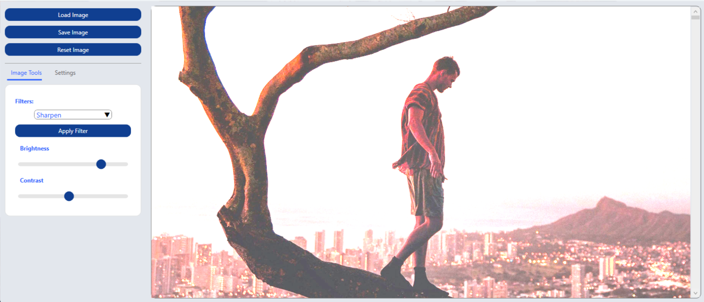

# ClarityAnalyzer

ClarityAnalyzer is a Windows desktop application built with WPF (.NET Framework 4.8.1) that allows users to load, analyze, and enhance images using essential image processing tools. It is designed for clarity inspection, scan quality checks, and prototype imaging use cases.

---



---

## ✨ Features

- 🖼 Load and preview images (JPG, PNG, BMP)
- 🎛 Apply filters: 
  - Grayscale
  - Invert Colors
  - Sharpen
  - Gaussian Blur
  - Box Blur
  - Edge Detection (Horizontal & Vertical)
- 💾 Save processed images
- 🔄 Reset image to original
- 🎚 Adjust Brightness and Contrast (live)
- 🎨 Modern UI with sidebar navigation
- 🧠 Modular image processing engine for future expansion

---

## 💻 Technologies Used

- C# / .NET Framework 4.8.1
- WPF (MVVM architecture)
- System.Drawing for pixel manipulation
- Microsoft.Xaml.Behaviors.Wpf for event binding

---

## 🚀 Getting Started

### 1. Clone the repository

```bash
git clone https://github.com/JacobBananalDev/ClarityAnalyzer.git
cd ClarityAnalyzer
````

### 2. Open in Visual Studio

* Open `ClarityAnalyzer.sln`
* Build the solution in **Release** mode
* Run or publish via Visual Studio

---

## 📦 Download Prebuilt Release

👉 [Download latest setup from Releases](https://github.com/JacobBananalDev/ClarityAnalyzer/releases/latest)

* Extract the `.zip`
* Run `setup.exe`
* No installation required

> ⚠️ .NET Framework 4.8.1 required (preinstalled on most Windows 10/11 systems)

---

## 🧪 Coming Soon

* Custom convolution kernel editor
* Region-based processing
* Export to PDF or TIFF
* Undo / history stack

---

## ✍️ Author

Made with ❤️ by [Jacob Bananal](https://github.com/JacobBananalDev)

